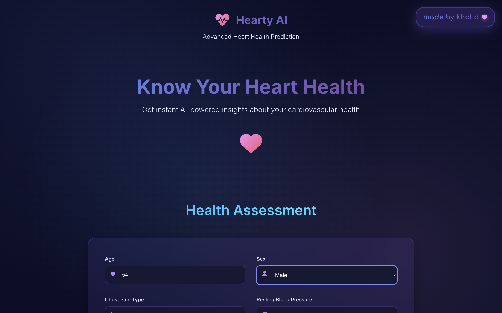
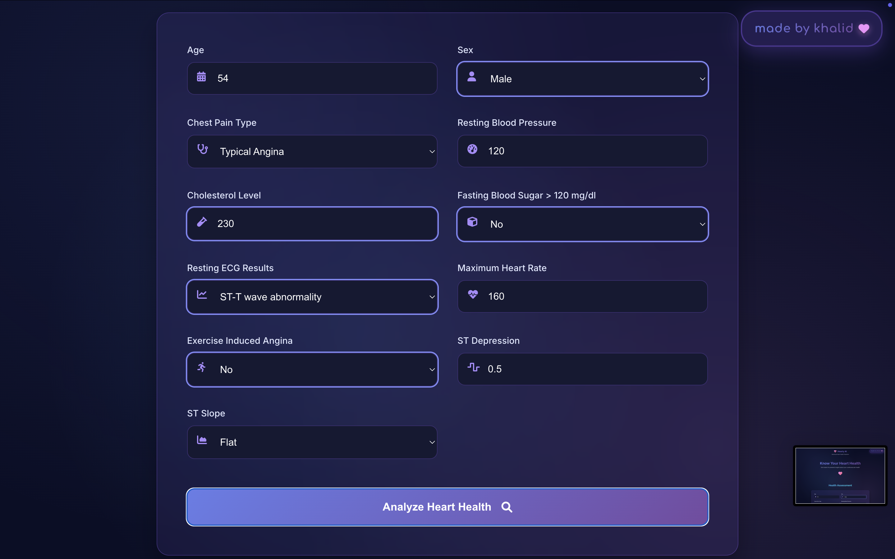
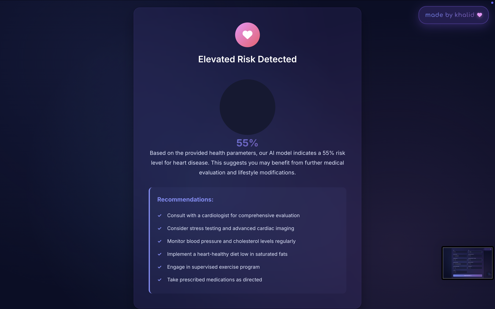

# Hearty AI - Heart Disease Predictor

A beautiful, interactive web application for heart disease prediction using machine learning.

## Features

- 🎨 Modern, gradient-based UI with beautiful animations  
- 🤖 AI-powered heart health predictions using your trained model  
- 📱 Responsive design that works on all devices  
- ⚡ Real-time form validation and interactive feedback  
- 🎯 Personalized recommendations based on risk factors  
- 🔒 Privacy-focused - all data stays on your device  

## 📸 Screenshots

### 🩺 Landing Page – Model Introduction

The landing page introduces **Hearty AI** with a clean design and a clear purpose.  
It highlights the AI-powered prediction capabilities and invites users to assess their heart health.



---

### 📝 Health Assessment Form – Patient Input

This section allows users to enter their personal health data including age, blood pressure, cholesterol level, ECG results, and more.  
All fields are validated instantly for a seamless experience.



---

### 📊 Result View – Model Prediction Output

After submitting the form, users receive a prediction percentage with a risk level.  
Recommendations are tailored based on input data to promote heart health and awareness.



---

## Getting Started

### Prerequisites

- Python 3.7 or higher  
- pip (Python package installer)  

### Installation

1. Create and activate a virtual environment:
   ```bash
   python3 -m venv venv
   source venv/bin/activate  # On Windows: venv\Scripts\activate
   ```

2. Install the required Python packages:
   ```bash
   pip install -r requirements.txt
   ```

3. Make sure your `model.pkl` file is in the same directory as `app.py`

### Running the Application

1. Activate the virtual environment (if not already activated):
   ```bash
   source venv/bin/activate  # On Windows: venv\Scripts\activate
   ```

2. Start the Flask server:
   ```bash
   python3 app.py
   ```

3. Open your web browser and navigate to:
   ```
   http://localhost:8080
   ```

3. Fill out the health assessment form and get your personalized heart health prediction!

## Usage

1. **Enter Health Information**: Fill out all the required fields in the health assessment form  
2. **Get Prediction**: Click "Analyze Heart Health" to get your AI-powered prediction  
3. **View Results**: See your risk score, detailed analysis, and personalized recommendations  
4. **Follow Recommendations**: Use the provided health recommendations to improve your cardiovascular health  

## Health Parameters

The application analyzes the following health parameters:

- **Age**: Your current age  
- **Sex**: Biological sex (M/F)  
- **ChestPainType**: Type of chest pain (TA, ATA, NAP, ASY)  
- **RestingBP**: Resting blood pressure  
- **Cholesterol**: Serum cholesterol level  
- **FastingBS**: Whether fasting blood sugar > 120 mg/dl (1/0)  
- **RestingECG**: Results of resting electrocardiogram (Normal, ST, LVH)  
- **MaxHR**: Maximum heart rate achieved during exercise  
- **ExerciseAngina**: Whether exercise induces chest pain (Y/N)  
- **Oldpeak**: ST depression induced by exercise  
- **ST_Slope**: Slope of peak exercise ST segment (Up, Flat, Down)  

## Technical Details

- **Frontend**: HTML5, CSS3, JavaScript (ES6+)  
- **Backend**: Flask (Python)  
- **Machine Learning**: Scikit-learn compatible model  
- **Styling**: Custom CSS with gradient animations  
- **Icons**: Font Awesome  

## Model Information

The application uses your pre-trained `model.pkl` file. The model should be trained on a heart disease dataset with the following features in order:

1. Age  
2. Sex (M/F)  
3. ChestPainType (TA/ATA/NAP/ASY)  
4. RestingBP (resting blood pressure)  
5. Cholesterol  
6. FastingBS (fasting blood sugar > 120 mg/dl)  
7. RestingECG (Normal/ST/LVH)  
8. MaxHR (max heart rate)  
9. ExerciseAngina (Y/N)  
10. Oldpeak (ST depression)  
11. ST_Slope (Up/Flat/Down)  

**Target variable**: HeartDisease (1/0)  

## Disclaimer

⚠️ **Important**: This application is for educational and demonstration purposes only. It should not be used as a substitute for professional medical advice, diagnosis, or treatment. Always consult with a qualified healthcare provider for medical concerns.

## Color Scheme

The application uses a beautiful gradient color scheme:

- **Primary Gradient**: Purple to violet (`#667eea` to `#764ba2`)  
- **Secondary Gradient**: Pink to red (`#f093fb` to `#f5576c`)  
- **Tertiary Gradient**: Blue to cyan (`#4facfe` to `#00f2fe`)  
- **Success Gradient**: Green to teal (`#43e97b` to `#38f9d7`)  
- **Background**: Dark navy (`#0a0e27`)  

## Contributing

Feel free to submit issues and enhancement requests!


## License

This project is for educational purposes. Please ensure you have appropriate rights to use any included machine learning models.
